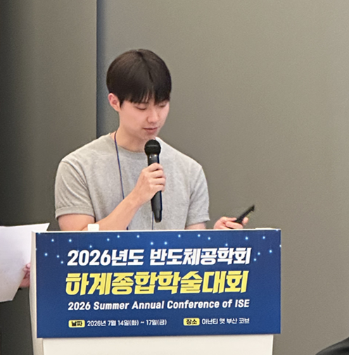
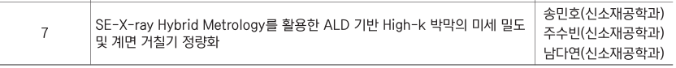

# 송민호 / Minho Song

## About Me

- **University:** Soongsil University
- **Major:** 신소재공학
- **Double Major:** 차세대반도체공학

반도체 공정·소자·계측 분야를 중심으로 TCAD 시뮬레이션, 데이터 분석 및 공정 프로젝트 경험을 쌓고 있습니다.

---

## Qualifications

### Certifications

- **데이터분석준전문가(ADsP)** | 한국데이터산업진흥원 | 2026.03.06 |  [View Credential](./adsp_certificate_public.png)
- **Adobe Certified Professional (ACP)** | Adobe | 2022.06.14 |  [View Credential](./adobe_acp_certificate_public.png)

---

## Projects

| Program / Competition | Period | Project Title | Main Focus | Link |
| :--- | :---: | :--- | :--- | :---: |
| **Chips Master Program (CMP)** | 2026.04–2027.01 | **GIDL Leakage Reduction in 20 nm BCAT DRAM** | TCAD 기반 BCAT 구조 변수 분석 및 누설전류 저감 설계 | [🔗](https://github.com/minhosong-mse/CMP) |
| **제16회 숭실 캡스톤디자인 경진대회** | 2026.07–Present | **Air Purifier with Zeolite-Based Filter Replacement Alert** | Round 1 Passed · Activated Carbon–Zeolite 4A Layered Filter and Real-Time VOC Saturation Monitoring | Private |
| **SSU Datathon 2025** | 2025.12–2026.01 | **A Data-Driven Trend Analysis of 60,000+ Research Papers** | 대규모 논문 데이터 전처리 및 연구 동향 분석 | [🔗](https://github.com/minhosong-mse/Datathon) |
| **AX (AI eXperience) 인터랙티브 콘텐츠 공모전** | 2026.07–2027.08 | **AI Interactive Tutor for Logic-to-Layout Learning** | 논리표에서 반도체 Layout으로 이어지는 설계 과정을 시각화하는 AI 학습 콘텐츠 개발 | [🔗](https://github.com/minho031207/AX) |

---

## Academic Coursework

| Course Name | Term | Project Title | Scope / Result | Link |
| :--- | :---: | :--- | :--- | :---: |
| **반도체집적공정** | 26-1 | **NMOS Contest & PMOS Process Optimization** | Individual Project · NMOS Contest 1st Place | [🔗](https://github.com/minhosong-mse/Semiconductor_Process_mid) |
| **반도체집적공정** | 26-1 | **Automotive Semiconductor-Oriented NMOS Optimization** | Team Project · 공정 조건에 따른 NMOS 특성 최적화 | [🔗](https://github.com/minhosong-mse/Semiconductor_Process) |
| **반도체공정과화학분석** | 26-1 | **SE–X-ray Hybrid Metrology를 활용한 ALD 기반 High-k 박막의 미세 밀도 및 계면 거칠기 정량화** | Literature-Based Metrology Project | [🔗](https://github.com/minhosong-mse/2026-SE-Xray-Hybrid-Metrology) |
| **디지털논리회로** | 26-1 | **Traffic Signal Controller Design using Vivado and Verilog** | Digital Logic Design Project | [🔗](https://github.com/minhosong-mse/Digital_Logic) |

> [🔗] 아이콘을 클릭하면 각 프로젝트의 상세 저장소로 이동합니다.

---

## Technical Training: 2026 Short Courses

숭실대학교 차세대반도체학과 주관 단기강좌에 참여하여  
반도체 공정·소자 시뮬레이션, 가상 공정 실습 및 AI 가속기 기반  
LLM 애플리케이션 구현 역량을 확장하고 있습니다.

각 저장소에는 일차별 실습 코드, 공정 조건, 결과 이미지, 정량 데이터 및 해석 과정을 기록합니다.

| Course | Period | Status | Main Topics | Repository |
| :--- | :---: | :---: | :--- | :---: |
| **반도체 공정 with TCAD** | 2026.07.20–07.22 | ✅ Completed | S-Process, Etch/Oxidation, Implant/Anneal, Gate Spacer, PMOS Conversion, High-k Gate Stack | [Repo 🔗](https://github.com/minhosong-mse/2026-TCAD-Process-Short-Course) · [Certificate 📄](https://github.com/minhosong-mse/2026-TCAD-Process-Short-Course/blob/main/certificate/2026_TCAD_Process_Short_Course_Certificate.pdf) |
| **반도체 소자 with TCAD** | 2026.07.24–07.29 | ⚪ Scheduled | NMOS, CMOS, MOSFET Physics, SCE, DRAM, Flash, S-Device | [🔗](https://github.com/minhosong-mse/2026-TCAD-Device-Short-Course) |
| **GPU·NPU 기반 LLM Agent 및 RAG 실습** | 2026.07.30–08.07 | ⚪ Scheduled | GPU/NPU Architecture, Prompt Engineering, Tool Calling, Agentic AI, RAG, Furiosa RNGD | [🔗](https://github.com/minhosong-mse/2026-LLM-Agent-RAG-Short-Course) |
| **VR을 활용한 반도체 공정 실습** | 2026.08.13–08.14 | ⚪ Scheduled | Etch, PECVD, PVD, Track, Exposure, Process Recipe, Failure Analysis | [🔗](https://github.com/minhosong-mse/2026-VR-Semiconductor-Process-Practice) |

### Documentation Structure

- **Practice Workflow:** 실습 순서, 사용 도구 및 공정 조건
- **Source Files:** TCAD Command, Python, Verilog 및 설정 파일
- **Results:** 공정 구조, 그래프, 파형 및 정량 결과
- **Troubleshooting:** 오류 원인과 해결 과정
- **Interpretation:** 변수에 따른 결과 변화와 공정적 의미
- **Reflection:** 실습의 한계와 후속 학습 방향

> 강좌 진행 상황과 실습 결과는 각 저장소에 순차적으로 업데이트합니다.

---

## Conference Presentation

### 2026년 반도체공학회 하계종합학술대회

2026년 반도체공학회 하계종합학술대회 특별세션에서  
**SE–X-ray Hybrid Metrology를 활용한 ALD 기반 High-k 박막의 미세 밀도 및 계면 거칠기 정량화**를 주제로 공동 발표하였습니다.

수업 프로젝트에서 시작한 계측 방법론을 외부 피드백을 통해 보완하고,  
3D 패턴 대응, 측정 영역 차이 및 양산 적용 가능성까지 검토한 내용을 발표했습니다.

  

  2026 반도체공학회 하계종합학술대회 특별세션 발표

- **Conference:** 2026년 반도체공학회 하계종합학술대회
- **Session:** 특별세션 — 숭실대학교 차세대반도체학과 1
- **Date:** 2026.07.15
- **Topic:** SE–X-ray Hybrid Metrology를 활용한 ALD 기반 High-k 박막의 미세 밀도 및 계면 거칠기 정량화
- **Presenters:** 송민호, 주수빈, 남다연
- **Role:** 공동 발표 및 SE 계측 원리·한계, 하이브리드 계측 적용 논리 설명

### Conference Feedback

발표 과정에서 **3D 패턴 대응과 측정 영역 차이를 고려하여 양산 가능성 검토를 보완한 점이 좋았다**는 피드백을 받았습니다.

동시에 현재 분석이 High-k 박막과 계면 특성에 집중되어 있다는 점에서 다음 질문을 받았습니다.

> 계면 자체뿐 아니라 계면 아래의 기판 또는 인접층과의 상호작용으로 나타나는 다른 결과도 검토했는가?

이 질문을 통해 계면을 독립적인 경계로만 해석하는 데 한계가 있음을 확인했습니다.  
향후에는 High-k 박막, 계면층 및 하부 기판이 연결된 구조에서 다음 영향을 추가로 검토할 계획입니다.

  

  
    Official Program Entry — Presentation No. 7 ·
    <a href="./assets/documents/2026_ISE_Summer_Conference_Program.pdf">
      View Full Conference Program
    </a>
  

### Presentation Records

- **Related Project:** [🔗 SE–X-ray Hybrid Metrology Repository](https://github.com/minhosong-mse/2026-SE-Xray-Hybrid-Metrology)
- **Presentation Material:** [🔗 발표 자료 PDF](./반도체공학회_발표자료.pdf)
- **Official Conference Program:** [🔗 2026 반도체공학회 하계종합학술대회 안내책자](./assets/documents/2026_ISE_Summer_Conference_Program.pdf)

> 공식 안내책자에는 2026년 7월 15일 숭실대학교 차세대반도체학과 특별세션의 발표 순서 7번으로 본 프로젝트의 제목과 발표자 명단이 수록되어 있습니다.

> **Reflection:** 학회 질의응답을 통해 계측 결과를 계면 자체에 한정하지 않고, 박막·계면층·기판 사이의 상호작용까지 포함하는 모델로 확장해야 한다는 후속 연구 방향을 구체화했습니다.

---

## Extracurricular Activities: 황토 Band Club

4년간의 밴드 동아리 활동을 통해 팀워크와 현장 리더십을 경험했습니다.

- **Affiliation:** 숭실대학교 공과대학 밴드 소모임 황토 (2022.03–현재)
- **Role:** 임원 및 공연 팀장
- **Key Activities:**
  - **공연 기획 및 운영:** 정기공연 5회, 대학 축제 1회, 새내기 배움터 1회 등 총 7회의 무대 준비 및 운영
  - **현장 관리:** 음향·악기 배치, 공연 일정 관리 및 돌발 상황 대응
  - **팀 협업:** 다양한 전공의 구성원들과 역할을 조율하고 공동 목표를 달성

**Instagram:**  

> **Reflection:** 공연 팀장 경험을 통해 역할 분담, 일정 조율 및 현장 문제 해결과 같은 프로젝트 운영 역량을 키웠습니다.
